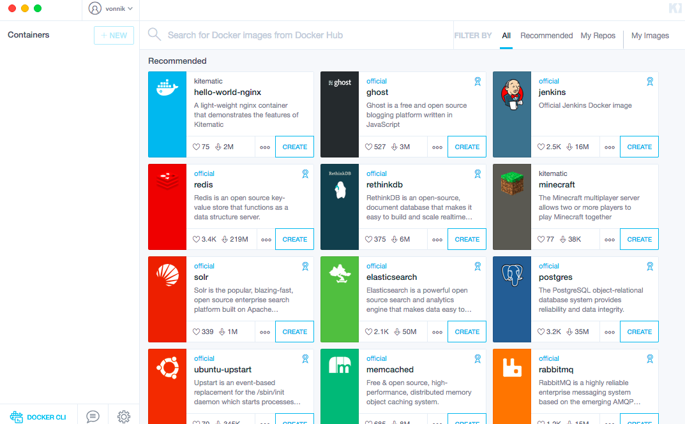
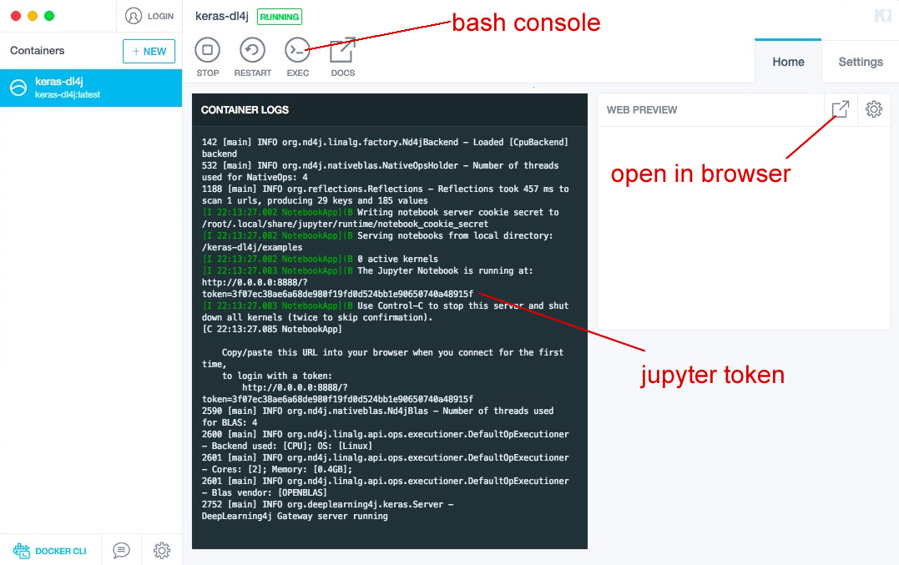
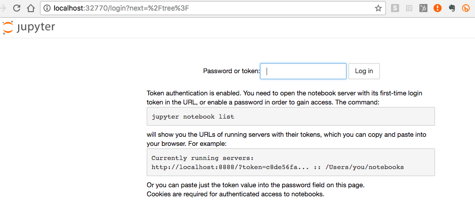
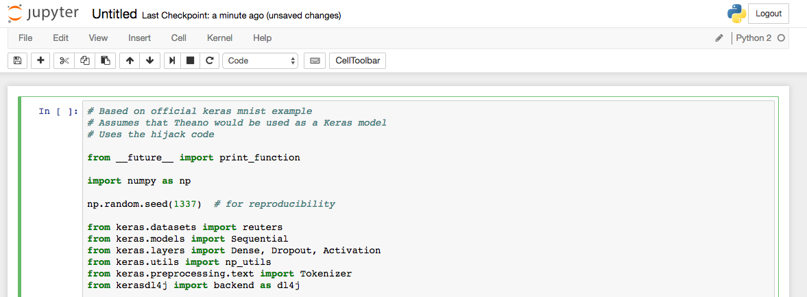
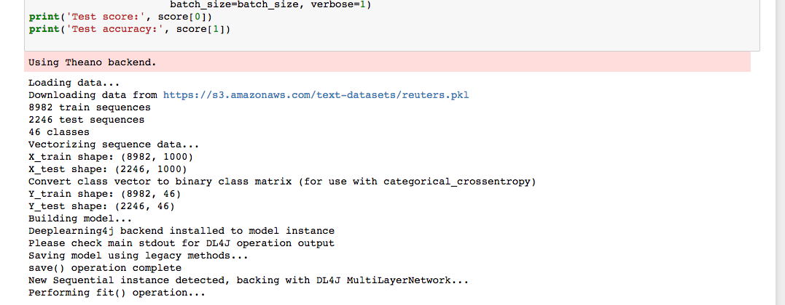
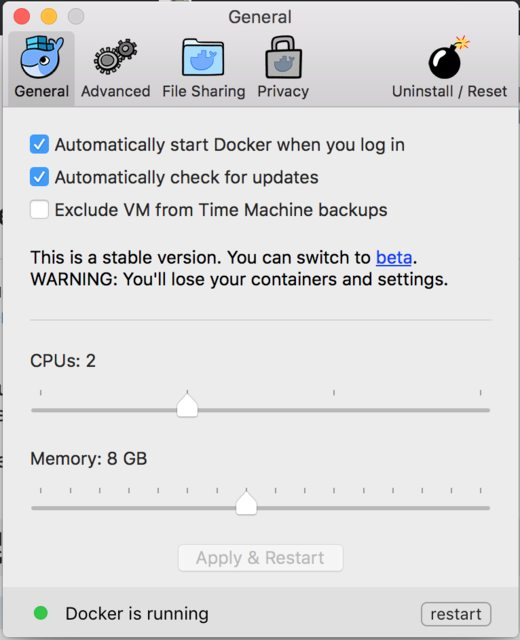

# Keras for Production (Python + JVM)

Deeplearning4j has a [Python API](https://github.com/crockpotveggies/dl4j-examples/tree/keras-examples/dl4j-keras-examples) that employs Keras, and it also enables developers to import models from other frameworks via Keras; that is, teams working in Python can port their work to scale on the JVM without wasting effort on rewrites. 

## Video: Model Import from Keras

<iframe width="560" height="315" src="https://www.youtube.com/embed/bI1aR1Tj2DM" frameborder="0" allowfullscreen></iframe>

The code for this tutorial is available on [Github](https://gist.github.com/tomthetrainer/f6e073444286e5d97d976bd77292a064).

[Keras](keras.io) is one of the most widely used open-source deep-learning tools for Python. With an API inspired by Torch, it provides a layer of abstraction on top of Theano and TensorFlow to make them easier to use. Keras allows users to import models from most major deep-learning frameworks, including Theano, TensorFlow, Caffe and Torch. And from Keras, it's possible to import those same models into Deeplearning4j. 

That's important chiefly because different frameworks solve different problems, and different programming languages dominate various phases of the deep learning workflow. While Python dominates the stage of data exploration and prototyping, it is not always the best suited for deployment to production. Deeplearning4j integrates closely with other open-source libraries common to the big data stack, such as Hadoop, Spark, Kafka, ElasticSearch, Hive and Pig. 

Deeplearning4j is also certified on Cloudera's CDH and Hortonworks's HDP distributions of the Hadoop ecosystem. For deep-learning practitioners seeking to take their neural-net models and put them to work in the the production stack of large organizations, model import from Keras to Deeplearning4j may help. 

Not every architecture supported by Keras and other deep learning frameworks is supported yet, but we're working to expand the number of nets that can be imported from Keras to DL4J. 

Python programmers interested in Scala, which offers a Python-like interface, may be interested in [ScalNet, Deeplearning4j's Scala API](https://github.com/deeplearning4j/scalnet). 

For more information, please see this page on [model import](https://deeplearning4j.org/model-import-keras).

## Running the DL4J-Keras Examples With Docker

* Install [Docker Toolbox](https://www.docker.com/products/docker-toolbox)

During the install process, you will be offered the choice between the Docker Quickstart Terminal and Kitematic. Choose Kitematic, which will have you sign up for Docker Hub. 

* Git clone the dl4j-examples branch below with the following line:

        git clone https://github.com/crockpotveggies/dl4j-examples --branch keras-examples --single-branch

The main Kitematic dashboard will look like this. 

Click on "My Images" on the upper right. One of your images then should be `keras-dl4j`.

Click "Create". 

Click on the icon on the upper right that will open a browser window for Jupyter using localhost. You'll get a screen that requires a Jupyter token, which you need to copy and paste from the bash console with Kitematic.

Once you paste your token in the field, you should see this. 

Click on "New" on the upper right and select Python 2 under notebooks, which will open up a new notebook in a new tab. 

Click on the Reuters MLP example at the bottom of the file list. Copy the Keras code and paste it into the new Python 2 notebook. In that notebook, on the toolbar, select the "Run Cell" button with the arrow pointing right.

That's going to start printing out results and logs at the bottom of the notebook, which will look like this.

While the results may say "loading Theano", we are actually hijacking Keras methods to make them run on the JVM with Py4J. 

You may run out of memory as the neural net trains locally. If that is the case, go to the menu bar of your laptop screen, click on the Docker whale icon, and select Preferences/Advanced. There, you can increase the amount of memory allocated to Docker. We suggest 8GB if you can spare them. 

If you do adjust the amount of memory allocated to Docker, you will need to restart it by clicking on the button on the lower right.

